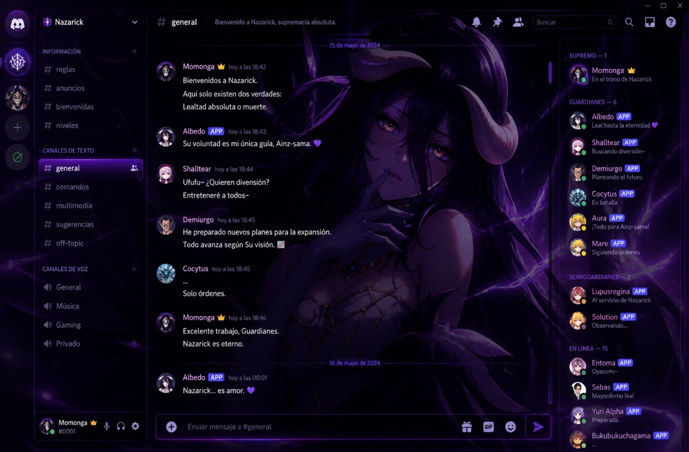

# 👑 Albedo Discord Theme


  Tema personalizado para Discord inspirado en Albedo (Overlord), diseñado para transformar completamente la interfaz mediante CSS, transparencias, efectos glow y una estética oscura basada en tonos púrpura.
</p>

---

## 🎯 Sobre el proyecto

Albedo Discord Theme es un proyecto de personalización visual desarrollado para explorar las posibilidades de diseño y modificación de interfaces mediante CSS.

Más allá de cambiar colores o añadir una imagen de fondo, el objetivo fue construir una identidad visual coherente inspirada en Albedo y el universo de Nazarick, manteniendo una experiencia elegante, inmersiva y funcional para el usuario.

---

## ✨ Características

- Interfaz completamente personalizada.
- Estética inspirada en Albedo y Nazarick.
- Transparencias avanzadas.
- Efectos glow personalizados.
- Fondo temático integrado.
- Colores púrpura personalizados.
- Diseño visual consistente.
- Mejor integración visual entre paneles.
- Compatibilidad con BetterDiscord y ClearVision.

---

## 🖼️ Vista previa

### Interfaz principal

<p align="center">
  
</p>

---

## 🎨 Elementos personalizados

- Barra lateral rediseñada.
- Lista de canales personalizada.
- Fondo temático integrado.
- Área de mensajes adaptada al estilo visual.
- Panel de miembros personalizado.
- Transparencias y efectos glassmorphism.
- Sombras y efectos glow.
- Colores y detalles inspirados en Nazarick.

---

## 🛠️ Tecnologías utilizadas

### Desarrollo

- CSS
- BetterDiscord
- ClearVision

### Diseño

- UI Customization
- Glassmorphism
- Visual Effects
- Theming

---

## 📚 Lo que aprendí

Durante el desarrollo de este proyecto trabajé en:

- Personalización avanzada mediante CSS.
- Diseño de interfaces visualmente consistentes.
- Uso de transparencias y efectos visuales.
- Adaptación de temas para aplicaciones existentes.
- Organización visual y experiencia de usuario.
- Creación de identidades gráficas coherentes.

---

## 🚀 Instalación

### 1. Instalar BetterDiscord

Descarga e instala BetterDiscord.

### 2. Descargar el tema

Obtén el archivo:

```txt
Albedo.theme.css
```

### 3. Copiar el archivo

Mueve el archivo a la carpeta de temas de BetterDiscord.

### 4. Activar el tema

Abre Discord y sigue la ruta:

```txt
Configuración
→ Themes
→ Activar Albedo Theme
```

---

## 📁 Estructura del proyecto

```txt
albedo-discord-theme
│
├── assets/
│   ├── albedo-bg.png
│   └── reference-mockup.png
│
├── Albedo.theme.css
├── README.md
├── LICENSE
└── .gitignore
```

---

## 💡 Motivación

Este proyecto nació como una forma de combinar dos áreas que disfruto especialmente:

- Diseño de interfaces.
- Personalización visual.

Fue una oportunidad para experimentar con CSS, mejorar habilidades de diseño UI y construir una experiencia visual única para Discord.

---

## 🔮 Posibles mejoras futuras

- Variantes de color adicionales.
- Más opciones de personalización.
- Optimización visual para distintas resoluciones.
- Nuevos estilos para paneles y componentes.

---

## ⭐ Soporte

Si te gusta el proyecto puedes:

- Dar una estrella al repositorio.
- Compartirlo.
- Utilizarlo como referencia para tus propios temas.

---

## ⚠️ Aviso

Este proyecto fue creado con fines educativos y de aprendizaje.

Discord, BetterDiscord, ClearVision y Overlord pertenecen a sus respectivos propietarios.
